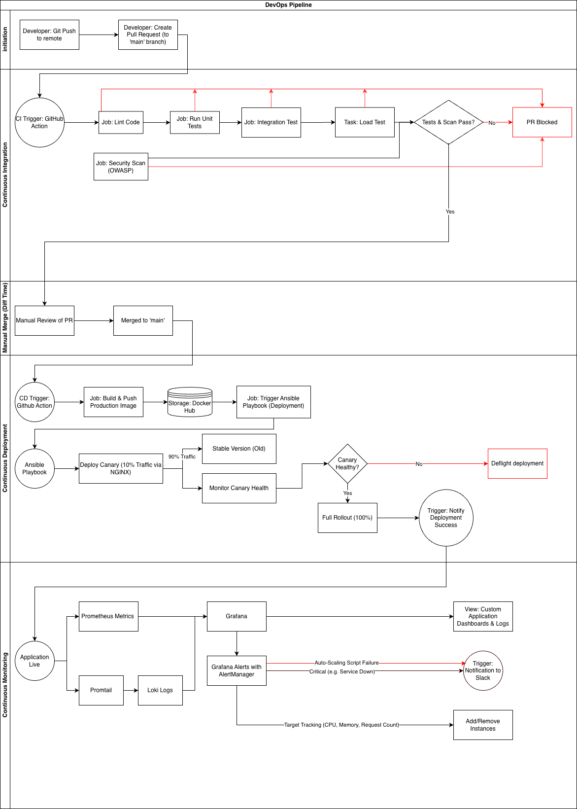

# distributed-banking-ops

## Overview

This project implements an event-driven CI/CD pipeline for a distributed banking application. Banking workloads demand real-time responsiveness, high fault-tolerance, and dynamic scaling, especially during traffic surges like Black Friday. Our pipeline automates testing, secure deployment, and continuous monitoring to ensure reliability, rapid yet safe delivery, and efficient infrastructure utilization.

By combining GitHub Actions, Docker, Ansible, Prometheus, Grafana, Loki, and automated scaling scripts, this system simulates a production-grade DevOps environment designed for mission-critical financial services.

Deployment automation, canary strategy details, and manual run instructions are documented in `docs/deployment.md`.

## Key Deliverables

- **Repository & Branch Protection**: Feature branches, PR workflows, protected release branch.
- **Automated CI Pipeline**: Linting, unit tests, integration tests, and security scans.
- **Test Environment Provisioning**: On-demand test containers & automated load testing.
- **Canary Deployment System**: Gradual rollout via NGINX and Ansible.
- **Load Balancing**: NGINX-based traffic routing across microservice instances.
- **Auto-Scaling Simulation**: Scale-out and scale-in containers driven by metrics thresholds.
- **Monitoring & Observability Stack**: Prometheus + Grafana dashboards, Loki logs, alerts.
- **Notifications & Rollback Mechanisms**: PR feedback, deployment alerts, automated rollback.

---

## Pipeline Architecture

The above diagram illustrates the complete event-driven CI/CD pipeline architecture, showing the flow from code commits through automated testing, deployment, canary releases, and monitoring.

## Technical Approach

This CI/CD pipeline delivers a high-availability, secure, and scalable deployment flow for a time-sensitive banking application. It runs in a local or simulated production lab, uses open-source tooling, and is structured into five event-driven phases: three automated and two manual.

### Continuous Integration (GitHub Actions)

**Location**: `.github/workflows/ci.yml` and `.github/workflows/security-scan.yml`

When a PR is opened to either `main` or `develop`, two GitHub Actions run in parallel:

1. **Security Scan** (`.github/workflows/security-scan.yml`):
   - Uses Bandit to analyze each microservice for issues such as SQL injection, hardcoded secrets, and weak randomness
   - Configurable vulnerability threshold with full reports uploaded as artifacts
   - Blocks PRs with high- or medium-severity findings

2. **Main CI Pipeline** (`.github/workflows/ci.yml`):
   - **Linting**: Uses flake8 for syntax and PEP 8 checks, black for formatting, and pylint for deeper static analysis
   - **Unit Tests**: Strict requirement that all tests pass and `service.py` maintains at least 75% coverage
   - **Integration Tests**: Powered by testcontainers, spinning up a temporary Docker environment to run five E2E flows across the fully containerized ecosystem
   - **Load Tests**: Using Locust, running the Docker stack under a one-minute, 10-user load test with performance metrics uploaded as artifacts

If any stage fails, the PR is blocked; if everything passes, the PR moves to Ready for Review.

**Test Locations**:

- Unit tests: `account-service/tests/`, `transaction-service/tests/`
- Integration tests: `integration-tests/`
- Load tests: `load-tests/`

### Continuous Deployment (GitHub Actions)

**Location**: `.github/workflows/deploy.yml`

The continuous deployment workflow is completely automated and begins as soon as changes are merged into the `main` branch. The GitHub Actions workflow orchestrates the full release pipeline by:

1. Building Docker images for each FastAPI microservice using the exact commit that appears on `main`
2. Logging into Docker Hub using GitHub Secrets and publishing the newly generated tags to the registry
3. Signing images with Cosign for tamper-proof verification
4. Remotely triggering the Ansible deployment playbook on the VCL host by securely injecting SSH keys, inventory details, and configuration variables

**Ansible Deployment** (`ansible/playbooks/deploy.yml`):

- Pulls the freshly built images from Docker Hub
- Prunes outdated containers
- Regenerates environment files
- Applies updated service definitions
- Restarts relevant components in a predictable and idempotent order

Together, the GitHub workflow and Ansible automation guarantee that every deployment is reproducible, consistent across environments, and free from manual configuration drift.

### Canary Deployment (Ansible + NGINX)

**Location**: `ansible/roles/nginx_canary/` and `ansible/roles/banking_app/`

Once the base deployment is applied, the pipeline enters the canary rollout phase, which is fully driven by Ansible and enforced through dynamic NGINX reconfiguration:

1. **Canary Provisioning**: Ansible provisions a parallel set of canary containers running the newly released version
2. **Traffic Splitting**: Updates the NGINX load balancer template (`ansible/roles/nginx_canary/templates/banking.conf.j2`) to direct roughly ten percent of incoming traffic to these containers while keeping the remaining ninety percent on the stable version
3. **Health Evaluation**: The monitoring stack evaluates canary behavior using Prometheus metrics such as request latency, error rate, and throughput
4. **Automated Rollback**: If the canary version exhibits instability, Ansible performs an immediate rollback by shutting down the canary containers, restoring the previous NGINX configuration, and routing all traffic back to the stable release
5. **Promotion**: If the canary performs reliably, Ansible promotes it to full production by retiring the old containers and shifting one hundred percent of traffic to the updated version

This structured canary mechanism ensures safe, measurable, and reversible deployments while maintaining zero downtime.

### Continuous Monitoring (Prometheus, Grafana, Loki)

**Location**: `monitoring/` directory

To ensure observability and automated infrastructure scaling, we implemented a comprehensive monitoring stack:

1. **Metrics Collection**: Prometheus scrapes time-series metrics from microservices
   - Configuration: `monitoring/prometheus-config.yml`
   - Service metrics: `account-service/app/prometheus/`, `transaction-service/app/prometheus/`
   - Shared metrics: `shared/prometheus/`

2. **Log Aggregation**: Promtail tails container logs and forwards them to Loki for structured indexing
   - Promtail config: `monitoring/promtail-config.yml`
   - Loki config: `monitoring/loki-config.yml`
   - Logging configuration: `shared/logging_config.py`

3. **Visualization**: Custom Grafana dashboards provide performance metrics with log streams for deep system visibility
   - Dashboards: `monitoring/grafana-dashboards/`
   - Dashboard provisioning: `monitoring/grafana-dashboard-provisioning.yml`
   - Data sources: `monitoring/grafana-datasources.yml`

4. **Alerting**: Grafana Alerting and AlertManager are configured to evaluate critical thresholds
   - Alert rules: `monitoring/grafana-alerting/rules-service-health.yml`, `monitoring/grafana-alerting/rules-autoscale.yml`
   - Contact points: `monitoring/grafana-alerting/contact-points.yml`
   - Policies: `monitoring/grafana-alerting/policies.yml`

5. **Auto-Scaling**: A firing alert invokes an autoscale-service webhook that dynamically scales service replicas via Docker
   - Auto-scale service: `autoscale-service/`
   - NGINX automatically discovers new instances via network aliases and Docker DNS resolution, balancing load dynamically across the scaled set

This ensures resource availability during spikes and enables scaling down when low traffic is observed, while simultaneously alerting engineers if manual intervention is required due to scaling failures.

### Branch Workflow (Develop → Main → Release)

**Branch Protection**: Direct pushes to `develop` and `main` branches are disabled via GitHub branch protection rules. All changes must flow through pull requests, ensuring code review and automated validation before any merge.

**Complete Workflow**:

1. **Feature Development** → Developers create feature branches from `develop` and implement changes
2. **Pull Request to Develop** → PR opened targeting `develop` triggers:
   - **CI Pipeline**: Automated linting, unit tests (75% coverage requirement), integration tests, load tests, and security scans (Bandit)
   - **Manual Review**: Release engineer reviews code changes, checks CI artifacts, and approves the PR
   - Upon approval and merge, changes land in `develop` branch
3. **Release Preparation** → When a validated set of changes in `develop` is ready for production:
   - PR opened targeting `main` branch
   - Same CI pipeline and manual review process runs
   - Upon approval and merge to `main`, triggers **deployment workflow**
4. **Production Deployment** → Merge to `main` automatically triggers:
   - Docker image build and push to Docker Hub with Cosign signing
   - Ansible deployment to production host
   - **Canary Deployment**: Gradual rollout with health checks and automated rollback
5. **Post-Deployment Monitoring and Scaling** → After deployment, the monitoring stack continuously:
   - Collects real-time metrics, logs, and traces from all services
   - Evaluates health checks and performance thresholds
   - Triggers alerts via Slack for service health issues and error spikes
   - Automatically scales service replicas based on demand and alert conditions

This workflow ensures all code is validated, reviewed, and safely deployed through controlled, auditable processes.

## Code Locations and Workflows

### GitHub Actions Workflows

- **CI Pipeline**: `.github/workflows/ci.yml` - Runs on PRs to `main`, `develop`, or `release`
- **Security Scan**: `.github/workflows/security-scan.yml` - Runs in parallel with CI on PRs
- **Deployment**: `.github/workflows/deploy.yml` - Triggers on merge to `main` or manual dispatch
- **CVE Scan**: `.github/workflows/cve-scan.yml` - Runs every 48 hours via cron or manual dispatch

### Microservices

- **Account Service**: `account-service/`
  - Application code: `account-service/app/`
  - Tests: `account-service/tests/`
  - Dockerfile: `account-service/Dockerfile`
  
- **Transaction Service**: `transaction-service/`
  - Application code: `transaction-service/app/`
  - Tests: `transaction-service/tests/`
  - Dockerfile: `transaction-service/Dockerfile`

- **Auto-Scale Service**: `autoscale-service/`
  - Application code: `autoscale-service/app/`
  - Dockerfile: `autoscale-service/Dockerfile`

### Shared Components

- **Shared utilities**: `shared/`
  - Events: `shared/events.py`
  - Logging: `shared/logging_config.py`
  - Prometheus metrics: `shared/prometheus/`

### Deployment Automation

- **Ansible Playbooks**: `ansible/playbooks/deploy.yml`
- **Ansible Roles**:
  - Banking app: `ansible/roles/banking_app/`
  - NGINX canary: `ansible/roles/nginx_canary/`
  - Docker setup: `ansible/roles/docker/`
- **Inventory**: `ansible/inventory/hosts.ini`
- **Ansible Config**: `ansible.cfg`

### Testing Infrastructure

- **Integration Tests**: `integration-tests/`
- **Load Tests**: `load-tests/`
  - Locust config: `load-tests/locust.conf`
  - Test script: `load-tests/locustfile.py`
  - Runner: `load-tests/run_load_test.sh`

### Monitoring and Observability

- **Prometheus**: `monitoring/prometheus-config.yml`
- **Loki**: `monitoring/loki-config.yml`
- **Promtail**: `monitoring/promtail-config.yml`
- **Grafana Dashboards**: `monitoring/grafana-dashboards/`
- **Grafana Alerting**: `monitoring/grafana-alerting/`

### Scripts

- **Build Scripts**: `scripts/build-images.sh`
- **Security Checks**: `scripts/check_bandit_results.py`, `scripts/check_vulnerabilities.py`

### Documentation

- **Deployment Guide**: `docs/deployment.md`
- **Setup Guide**: `setup.md`
- **Pipeline Diagram**: `docs/diagrams/pipeline_architecture.png`

## Security Features

### GitHub Secrets Integration

- Migrated all sensitive values (SSH keys, DB creds, host info) into GitHub Secrets to prevent plaintext exposure and ensure secure runtime injection
- **Location**: Configured in GitHub repository settings and referenced in `.github/workflows/deploy.yml`

### Cosign Image Signing

- Added Cosign to sign Docker images during build and verify signatures during deployment
- Ensures only trusted, tamper-free images run in production
- **Location**: `.github/workflows/deploy.yml` (signing), `ansible/roles/banking_app/tasks/main.yml` (verification)

### Sensitive Data Masking

- Implemented application-level masking to redact financial data before logs reach Loki/Promtail
- Eliminates PII leakage risk
- **Location**: `shared/logging_config.py`

### Trivy Vulnerability Scanning

- Set up automated Trivy scans every 48 hours to detect high-severity image and dependency vulnerabilities early
- Enforces shift-left security
- **Location**: `.github/workflows/cve-scan.yml`

### CVE Scan Cron Job

- Added a recurring job that evaluates dependency vulnerabilities, reports known CVEs, and suggests patched versions
- Streamlines developer remediation
- **Location**: `.github/workflows/cve-scan.yml`, `scripts/check_vulnerabilities.py`

### Security Scan in CI

- Integrated Bandit to detect hardcoded secrets, SQL injection risks, and OWASP-mapped issues
- Blocks PRs with high- or medium-severity findings
- **Location**: `.github/workflows/security-scan.yml`, `scripts/check_bandit_results.py`

## Additional Resources

- **Deployment Guide**: `docs/deployment.md` - Detailed deployment automation and canary strategy
- **Setup Guide**: `setup.md` - Local development setup and API documentation
- **Contributing Guidelines**: `CONTRIBUTING.md` - Contribution guidelines and best practices
